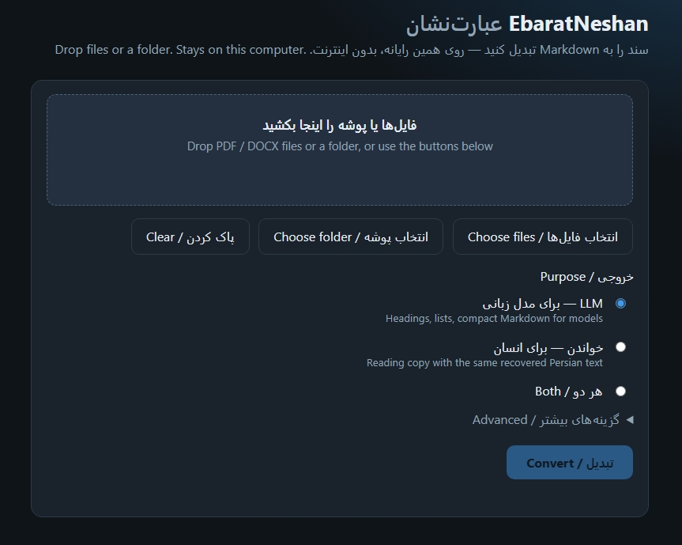

# EbaratNeshan

**عبارت‌نشان** — local **PDF & Word → Markdown**, and **Markdown → HTML / Word / PDF / TXT**. Persian and Arabic keep real letters and a sensible reading order. English and other left-to-right languages become structured text for search, archives, and LLMs.

No programming is required. A simple page runs on **your computer only**. Two tabs: **To MD** (drop PDF/DOCX) and **From MD** (drop `.md`, pick one or more export formats).

---

<div align="center">

### Built for ALL writing directions — RTL and LTR

**RTL:** Persian (Farsi), Arabic, and other right-to-left scripts (for example Hebrew, Urdu, Kurdish), as far as the file actually contains text.

**LTR:** English, French, German, Spanish, Turkish, and other left-to-right languages.

**Mixed pages** are expected: Persian or Arabic together with English terms, numbers, URLs, IP addresses, code, tables, dates, and software versions.

</div>

<div dir="rtl" align="right">

### ساخته‌شده برای همهٔ جهت‌های نوشتار — راست‌به‌چپ و چپ‌به‌راست

**راست‌به‌چپ:** فارسی، عربی، و دیگر خط‌های راست‌به‌چپ (مثلاً عبری، اردو، کردی)، تا جایی که خودِ فایل واقعاً متن داشته باشد.

**چپ‌به‌راست:** انگلیسی، فرانسوی، آلمانی، اسپانیایی، ترکی، و زبان‌های دیگر چپ‌به‌راست.

**صفحات ترکیبی** عادی هستند: فارسی یا عربی در کنار اصطلاح انگلیسی، عدد، نشانی وب، IP، کد، جدول، تاریخ و نسخهٔ نرم‌افزار.

</div>

<table>
<tr>
<td width="50%" valign="top">

- No advanced technical knowledge
- Local GUI: double-click `web.bat` (Windows) or run `python3 run_web.py`
- Drag and drop **one file, many files, or a folder**
- **From MD:** export Markdown to HTML, Word `.docx`, PDF, or TXT into `output/html`, `output/docx`, …
- Documents **stay on this computer** — conversion does not upload them
- Useful for LLMs, RAG, search, archiving, reading, and sharing

</td>
<td width="50%" valign="top" dir="rtl" align="right">

- نیازی به دانش فنی پیشرفته نیست
- صفحهٔ سادهٔ محلی: `web.bat` یا `python3 run_web.py`
- یک فایل، چند فایل، یا یک **پوشه** را بکشید و رها کنید
- **از Markdown:** خروجی HTML، ورد `.docx`، PDF یا TXT در پوشه‌های `output/`
- سندها **روی رایانهٔ خودتان** می‌مانند و آپلود نمی‌شوند
- مناسب مدل زبانی، RAG، جست‌وجو، بایگانی، خواندن و اشتراک

</td>
</tr>
</table>

EbaratNeshan is designed to preserve **logical Unicode** and reading order as accurately as possible. It is especially careful with difficult **Persian/Arabic Word-generated PDFs**. Complex, scanned, damaged, or unusual PDFs can still need a human look. Conversion is not perfect for every file.

**GitHub description** (paste when you publish):

> Offline PDF & Word → Markdown, then Markdown → HTML / Word / PDF. Recovers real Persian/Arabic letters from broken Word PDFs. RTL, LTR, mixed pages. LLM-ready. Files never leave your computer.

**GitHub topics:** `pdf` `markdown` `persian` `arabic` `rtl` `llm` `rag` `offline` `docx` `ocr-alternative`

<p align="center">
  
</p>

<p align="center"><em>Local page at <code>http://127.0.0.1:8765/</code> — two tabs: To MD (PDF/DOCX) and From MD (export). Screenshot shows the To MD tab. Nothing is uploaded.</em></p>

---

## Before and after

Ordinary copy or extract from some old Iranian Word PDFs looks correct on screen but produces the wrong letters:

```text
پااغ اص تؼشیااف فایاال اماالام دادُ …
```

EbaratNeshan rebuilds **logical Unicode** from the embedded font:

```text
پس از تعریف فایل اقلام داده‌ای …
```

A bilingual test file with no personal data is in [`examples/sample-fa-en.docx`](examples/sample-fa-en.docx). Converted Markdown: [`examples/sample-fa-en.md`](examples/sample-fa-en.md).

<div dir="rtl" align="right">

کپی معمولی از بعضی PDFهای قدیمی ورد ایرانی حروف غلط می‌دهد. EbaratNeshan حروف منطقی را برمی‌گرداند. نمونهٔ بدون دادهٔ شخصی: پوشهٔ `examples/`.

</div>

---

## Contents

- [Why Markdown matters](#why-markdown-matters)
- [Why Persian and Arabic PDFs break](#why-persian-and-arabic-pdfs-break)
- [Before and after](#before-and-after)
- [Easy start](#easy-start)
- [Install Python and requirements](#install-python-and-requirements)
- [What it can do](#what-it-can-do)
- [From Markdown](#from-markdown)
- [Settings (`config.json`)](#settings-configjson)
- [Output folders](#output-folders)
- [Tables and figures](#tables-and-figures)
- [Current limitations](#current-limitations)
- [Project status](#project-status)

---

## Why Markdown matters

**For anyone:** Markdown is ordinary text. You can open it in Notepad, VS Code, or GitHub. Headings, lists, and tables stay visible as text instead of being locked inside a page layout. The files are usually smaller than Word/PDF, easy to search, and easy to keep in Git.

**For LLM / RAG work:** models read structure well. A `#` heading and a pipe table tell the model what is a title and what is a grid — better than a flattened visual dump. That helps chunking, retrieval, summarization, translation, and question answering.

**Tiny example** — a Word/PDF section becomes:

```markdown
# روش کار

پس از تعریف ورودی، مدل متن را در قالب Markdown می‌بیند.

- مرحلهٔ یک
- مرحلهٔ دو

See `docs/api` and https://example.com for the English identifier.
```

<div dir="rtl" align="right">

### چرا Markdown مهم است

Markdown متن ساده است؛ بدون نرم‌افزار اداری خاص خوانده می‌شود. عنوان، فهرست و جدول در خودِ متن می‌مانند. برای مدل زبانی، این ساختار از «شکل صفحه» مفیدتر است: تکه‌تکه کردن، جست‌وجوی معنایی، RAG، خلاصه، ترجمه و پرسش‌وپاسخ دقیق‌تر می‌شود. نگهداری در Git و دیدن تفاوت نسخه‌ها هم آسان است.

</div>

---

## Why Persian and Arabic PDFs break

**Simple picture:** some older Iranian Word PDFs (fonts such as B Zar, B Nazanin, B Titr) **look correct on screen**, but Copy or ordinary extractors produce the wrong letters — for example `پااغ اص تؼشیاف` instead of `پس از تعریف`. Text can feel reversed, use presentation-form glyphs, or be stretched with kashida/tatweel. The file “prints” fine; the Unicode inside is not what a reader or an LLM needs.

**What EbaratNeshan does:** it recovers a character map from the **embedded font** (glyph names, cmap, presentation-form groups, outline matching), and it does **not** blindly trust a broken ToUnicode table when a better reconstruction is possible. It strips kashida, maps shaped Arabic forms to logical letters (Persian `ی` / `ک`, not `ي` / `ك` when that is the right fold), rebuilds RTL order from **positions**, and writes Markdown (often wrapped for RTL).

**Developer notes:** many of these PDFs use Identity-H glyph IDs. Word sometimes writes a ToUnicode map by walking consecutive Arabic code points, which does not match the real glyphs. Shaped isolated/initial/medial/final forms must be normalized to logical Unicode. English-trained “reading order” models are a poor fit; geometry works better here.

Scanned pages (pictures of text, no real text layer) and fonts with no usable names may need **OCR** or manual review. That is not fully automatic yet.

<div dir="rtl" align="right">

### چرا PDFهای فارسی و عربی خراب می‌شوند

بعضی PDFهای قدیمی ورد ایرانی روی صفحه درست دیده می‌شوند، اما کپی یا استخراج معمولی حروف غلط می‌دهد. نقشهٔ ToUnicode ممکن است گمراه‌کننده باشد، گلیف‌های شکل‌گرفته و کشیده (کشیله) در فایل باشند، و ترتیب خواندن راست‌به‌چپ از روی موقعیت ساخته شود نه از روی حدس انگلیسی.

EbaratNeshan نقشه را از فونت جاسازی‌شده بازیابی می‌کند، در صورت امکان ToUnicode خراب را کنار می‌گذارد، کشیده را حذف می‌کند، و حروف منطقی فارسی را می‌نویسد. PDF اسکن‌شده یا فونت به‌شدت آسیب‌دیده ممکن است به OCR یا بازبینی دستی نیاز داشته باشد.

</div>

---

## Easy start

You do not need to write code. **Python** is only the small engine that runs EbaratNeshan.

### Windows (most users)

1. Copy this project folder to your computer (ZIP extract, or GitHub Desktop).
2. Double-click **`install.bat`** once. It looks for Python 3.11+, installs Python 3.13 with `winget` if needed, then puts packages into `vendor/libs`.
3. Double-click **`web.bat`**. Leave the black terminal window **open**.
4. A page should open at `http://127.0.0.1:8765/`.
5. **To MD:** drop a PDF or DOCX — or several files — or a **folder**. Choose LLM, reading, or both. Click **Convert**.
6. **From MD:** drop `.md` files, tick HTML / Word `.docx` / PDF / TXT (several at once is fine), click **Export**. Files go into `output/html`, `output/docx`, `output/pdf`, `output/txt`.
7. Converted Markdown from To MD is under `output/llm` and/or `output/reading` (paths still follow `config.json`).

`127.0.0.1` means **this computer**, not a public website. Conversion does not send your documents to a remote server. Files you drop are copied into `_uploads/` first; the Markdown you keep is under `output/`.

If the page does not open, install Python from [python.org/downloads/windows](https://www.python.org/downloads/windows/) (tick **Add python.exe to PATH**), run `install.bat` again, then `web.bat`.

**Optional:** `convert.bat` converts using `config.json` without the browser. In VS Code, launches **EbaratNeshan: web page** and **EbaratNeshan: convert** are included.

### macOS and Linux

`.bat` files are Windows-only. In Terminal:

```bash
chmod +x install.sh
./install.sh
python3 run_web.py
```

Install Python 3.11+ first if `python3` is missing (`brew install python` on macOS, or your package manager on Linux). Leave the terminal open. Open `http://127.0.0.1:8765/` if the browser does not appear.

<div dir="rtl" align="right">

### شروع آسان

نیازی به برنامه‌نویسی نیست. روی ویندوز یک‌بار `install.bat` و بعد `web.bat` را دوبار کلیک کنید. پنجرهٔ ترمینال را باز بگذارید. صفحه روی **همین رایانه** باز می‌شود (`127.0.0.1`). تب **به Markdown** برای PDF/DOCX است؛ تب **از Markdown** فایل `.md` را به HTML، ورد، PDF یا TXT می‌برد. نتیجه در `output/` است. سندها به اینترنت فرستاده نمی‌شوند.

در مک و لینوکس از `install.sh` و `python3 run_web.py` استفاده کنید؛ فایل `.bat` اجرا نمی‌شود.

</div>

---

## Install Python and requirements

Conversion itself is **offline**. Packages live in this repo:

| Path | Role |
|------|------|
| `vendor/wheels/` | Downloaded `.whl` files shipped with the project |
| `vendor/libs/` | Unpacked libraries used at runtime (created by the installer; not stored in git) |
| `requirements.txt` | Pinned package list |

**Windows — easiest:** double-click `install.bat`.

What it does:

1. Finds Python 3.11 or newer (`py`, `python`, or a typical user install path).
2. If Python is missing, tries `winget install Python.Python.3.13` (user scope). If that fails, it opens the official Windows download page.
3. Installs requirements **into `vendor/libs`**.
4. If you have **Windows 64-bit + Python 3.13**, it installs **from `vendor/wheels` with no internet**.
5. Any other Python version or OS downloads packages with `pip` **once** (internet required for that step only).

`web.bat` and `convert.bat` run `install.bat` automatically if `vendor/libs` is missing.

**Windows — same steps in a terminal:**

```powershell
cd EbaratNeshan
.\install.bat
python run_web.py
```

If you prefer to run pip yourself (still targeting `vendor/libs`):

```powershell
cd EbaratNeshan
python -m pip install --no-index --find-links=vendor\wheels -r requirements.txt -t vendor\libs
python run_web.py
```

If the wheels do not match your Python, drop `--no-index --find-links=...` and let pip download:

```powershell
python -m pip install -r requirements.txt -t vendor\libs
```

**Command-line conversion** (after packages are installed):

```powershell
cd EbaratNeshan
python run.py
```

`config.json` chooses the input file or folder and the output paths. The local web page can override purpose, overwrite, table/figure images, Persian digits, and LLM split. Output **directories** still come from `config.json`.

**macOS / Linux:**

```bash
cd EbaratNeshan
python3 -m pip install -r requirements.txt -t vendor/libs
python3 run_web.py
python3 run.py
```

Or `./install.sh`. Bundled wheels are **Windows + CPython 3.13**; other systems use PyPI.

Pinned libraries today: `pypdf`, `fonttools`, `python-docx`, `pypdfium2`, `pillow`, plus `lxml` and `typing_extensions`.

<div dir="rtl" align="right">

### نصب پایتون و کتابخانه‌ها

خودِ تبدیل به اینترنت نیاز ندارد. روی ویندوز `install.bat` پایتون را در صورت نیاز نصب می‌کند (با winget یا با راهنمایی به python.org) و بسته‌ها را داخل `vendor/libs` می‌گذارد. اگر پایتون ۳٫۱۳ ویندوز باشد، از چرخ‌های داخل `vendor/wheels` و **بدون دانلود** نصب می‌شود؛ در غیر این صورت یک‌بار `pip` از اینترنت می‌گیرد. مک و لینوکس: `install.sh` یا دستورهای `pip` بالا.

</div>

---

## What it can do

- Input: **PDF** and modern **DOCX** (old `.doc` is not supported)
- One file, several files, or a whole folder (non-PDF/DOCX files in a folder are skipped)
- Local two-tab page: **To MD** and **From MD**; optional `config.json` + `convert.bat` / `run.py`
- Offline conversion after the one-time package step
- **LLM** Markdown and a **reading** copy (or both)
- RTL (Persian, Arabic, and similar), LTR (English and similar), and mixed documents
- Logical Unicode rather than visual glyph forms, when recovery works
- RTL-aware reading order from layout
- Markdown pipe tables; optional table PNG screenshots; optional figure crops
- YAML header: title, language, source, table/figure counts
- Optional Latin `1–9` → Persian `۱–۹` (image link URLs left alone)
- Optional LLM split: `parts/01-….md` (one file per `#` heading)
- If `overwrite` is false, extra runs use `name(2)`, `name(3)`, …
- `convert.log` in each To MD job folder
- **From MD:** Markdown → HTML, Word `.docx`, PDF, TXT into `output/<format>/` (tick several formats at once)

<div dir="rtl" align="right">

### امکانات

PDF و DOCX مدرن؛ یک فایل یا پوشه؛ صفحهٔ محلی با دو تب (به Markdown / از Markdown)؛ کار آفلاین بعد از نصب بسته؛ خروجی LLM و خواندنی؛ یونیکد منطقی و ترتیب راست‌به‌چپ وقتی بازیابی ممکن باشد؛ جدول Markdown و در صورت تمایل تصویر جدول/شکل؛ سرآیند YAML؛ ارقام فارسی اختیاری؛ تقسیم بر عنوان سطح یک برای LLM؛ نام‌گذاری امن در صورت خاموش بودن overwrite؛ `convert.log`؛ و خروجی HTML / ورد / PDF / TXT از فایل Markdown.

</div>

---

## From Markdown

The **From MD** tab writes each chosen format into its own folder under `output_root` (default `output/`):

| Format | Folder | File |
|--------|--------|------|
| HTML | `output/html/` | `.html` |
| Word | `output/docx/` | `.docx` (not old `.doc`) |
| PDF | `output/pdf/` | `.pdf` when Edge or Chrome is installed; otherwise a printable `.print.html` |
| Plain text | `output/txt/` | `.txt` (Markdown body without YAML) |

You can select several formats in one run. Same-name files get `(2)`, `(3)`, … unless overwrite is on. After a **To MD** conversion, the result card also has buttons that download the same formats (those copies are saved next to that job’s `.md` as well).

PDF export is local: it asks Microsoft Edge or Google Chrome to print HTML to PDF. No cloud conversion.

<div dir="rtl" align="right">

### از Markdown

در تب **از Markdown** قالب‌ها را تیک بزنید. هر قالب پوشهٔ خودش را زیر `output/` می‌سازد: `html`، `docx`، `pdf`، `txt`. چند قالب با هم مجاز است. PDF با مرورگر محلی ساخته می‌شود؛ اگر Edge/Chrome نباشد، یک HTML برای چاپ ذخیره می‌شود. ورد قدیمی `.doc` پشتیبانی نمی‌شود.

</div>

---

## Settings (`config.json`)

| Key | Meaning |
|-----|---------|
| `purpose` | `"llm"`, `"reading"`, or `"all"` |
| `input` | One PDF/DOCX path, or `""` / empty to convert every PDF/DOCX in `input_root` |
| `input_root` | Folder to scan when `input` is empty |
| `output_root` | Parent output folder (default `output`) |
| `output_llm` | Child folder name for LLM jobs (default `llm`) |
| `output_reading` | Child folder name for reading jobs (default `reading`) |
| `overwrite` | `false`: keep old folders and use `file(2)`, `file(3)`, … · `true`: delete that job folder and write again |
| `table_images` | `true`: Markdown table + PNG crop · `false`: Markdown table only |
| `figure_images` | `true`: crop a figure PNG · `false`: text labels only |
| `persian_digits` | `true`: fold `1–9` to `۱–۹` (skips Markdown link URLs) |
| `split_llm` | `true`: also write `parts/` for LLM purpose, one file per `#` heading |
| `title` | Optional title for the YAML header; otherwise the file name stem |
| `report` | Extra font-mapping notes on the command-line run |

Assets are **not** shared between LLM and reading folders.

**Developer note:** `run.py` / `convert.bat` read this file and convert. The web page uploads a copy into `_uploads/`, then calls the same conversion with the purpose and checkboxes from the form. Boolean values in JSON are `true` / `false`.

<div dir="rtl" align="right">

### تنظیمات

`purpose` نوع خروجی را مشخص می‌کند. `input` یک فایل است یا خالی تا همهٔ PDF/DOCXهای `input_root` تبدیل شوند. با `overwrite` خاموش، پوشهٔ قبلی پاک نمی‌شود و پسوند `(2)` و `(3)` ساخته می‌شود. تصویر جدول و شکل، ارقام فارسی، و تقسیم LLM اختیاری‌اند. صفحهٔ وب پوشهٔ خروجی را از همین فایل می‌گیرد ولی purpose و چند گزینه را از فرم عوض می‌کند.

</div>

---

## Output folders

Example when `purpose` is `"all"` and `split_llm` is on:

```text
output/
├── llm/
│   └── Extracted pages from/
│       ├── Extracted pages from.md
│       ├── convert.log
│       ├── assets/
│       │   └── page-01-figure.png
│       └── parts/
│           └── 01-Introduction.md
├── reading/
│   └── Extracted pages from/
│       ├── Extracted pages from.md
│       ├── convert.log
│       └── assets/
│           └── page-01-table.png
├── html/
│   └── notes.html
├── docx/
│   └── notes.docx
├── pdf/
│   └── notes.pdf
└── txt/
    └── notes.txt
```

| Item | Role |
|------|------|
| `llm/`, `reading/` | To MD jobs (Markdown, optional `assets/` and `parts/`) |
| `html/`, `docx/`, `pdf/`, `txt/` | From MD exports, one folder per format |
| `*.md` | Main Markdown (YAML header + body) |
| `assets/` | Optional PNG crops (tables/figures). LLM and reading each have their own copy |
| `parts/` | Extra LLM files split on `#` headings |
| `convert.log` | What was converted, flags, warnings, font mapping notes |
| YAML header | `title`, `source`, `lang`, `purpose`, `tables`, `figures` |

<div dir="rtl" align="right">

### خروجی

تبدیل به Markdown در `llm/` و `reading/` است. خروجی از Markdown در `html/`، `docx/`، `pdf/` و `txt/` ذخیره می‌شود.

</div>

---

## Tables and figures

- **PDF tables:** Word-style cell rectangles are clustered into a grid, text is assigned to cells, and Markdown pipe tables are emitted in reading order. RTL columns are ordered right-to-left. Merged cells are **repeated** (Markdown has no `rowspan` / `colspan`). If `table_images` is true, a cropped `page-NN-table.png` is saved above the table.
- **DOCX tables:** native Word tables are walked in document order and written as the same pipe tables.
- **Flowcharts are not tables.**
- **Figures:** optional PNG crops; if disabled, only text labels are emitted.

<div dir="rtl" align="right">

### جدول و شکل

جدول PDF از مستطیل سلول‌های ورد به شبکه تبدیل می‌شود؛ جدول DOCX از ساختار ورد خوانده می‌شود. سلول ادغام‌شده تکرار می‌شود چون Markdown ردیف/ستون ادغامی ندارد. فلوچارت جدول حساب نمی‌شود. تصویر جدول و شکل اختیاری است.

</div>

---

## Current limitations

| Limitation | Why it happens | What EbaratNeshan does | What you can do |
|------------|----------------|------------------------|-----------------|
| No true merged table cells | Markdown has no `rowspan` / `colspan` | Repeats merged text; optional table PNG | Keep the PNG or the original PDF for layout |
| Complex page design / exact fonts | Markdown is structure, not a page designer | Recovers text + optional figure PNGs | Keep the source file for print-perfect layout |
| Scanned PDF with no text layer | There are no characters to map | Cannot invent text | OCR first, or check those pages by hand |
| Encrypted, damaged, or odd fonts | Glyph map may be missing or hostile | Recovers when the embedded font allows | Export again from Word, keep the original, report a **non-sensitive** sample |
| Mixed RTL/LTR with code, URLs, IPs, hashes | Bidi layout is hard | Aims for logical Unicode and position-based RTL | Skim the **reading** output for those lines |
| PDF export without Edge/Chrome | Headless print needs a local browser | Writes `.print.html` instead of `.pdf` | Open that HTML and Print → Save as PDF |

<div dir="rtl" align="right">

### محدودیت‌ها

جدول ادغامی واقعی در Markdown نیست؛ چیدمان تزئینی صفحه حفظ نمی‌شود؛ PDF اسکن‌شده متن ندارد؛ فونت خراب یا فایل رمزگذاری‌شده ممکن است کامل بازیابی نشود؛ مخلوط راست‌به‌چپ و کد/نشانی وب را یک‌بار در خروجی خواندنی نگاه کنید. اگر Edge/Chrome نباشد، خروجی PDF یک HTML قابل چاپ است.

</div>

---

## Project status

**This is the beginning, not the finish line.** EbaratNeshan is evolving. The goal is document-to-Markdown conversion that is more accurate, more private, and easier to use.

<div dir="rtl" align="right">

**این شروع کار است، نه خط پایان.** هدف این است که تبدیل سند به Markdown دقیق‌تر، خصوصی‌تر و برای همه آسان‌تر شود.

</div>

Planned next steps:

- Old binary `.doc`
- Better figure reconstruction (including Mermaid-style or labeled boxes)
- OCR fallback when fonts have no usable names
- Ongoing accuracy work for RTL, LTR, mixed scripts, tables, and layout

If a real file comes out wrong, open a GitHub issue with **page number**, **expected text**, **actual text**, and **PDF vs DOCX**. Do not upload confidential documents. Pull requests that improve recovery, tables, or docs are welcome; keep samples tiny and free of personal data.

License: [MIT](LICENSE).

---

<div align="center">

<br/>

**10,000,000,000%**

### Ten billion percent: every impossible system is just an unsolved problem.

<sub>Senku Ishigami · <a href="https://github.com/drSenkuIshigami">drSenkuIshigami</a></sub>

</div>
